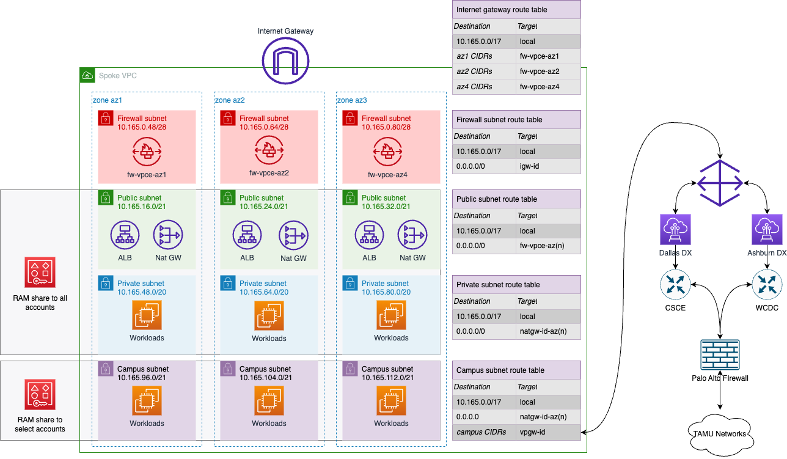

# Networking

This section will cover the networking services provided by TAMU in Amazon Web Services (AWS). 

The Technology Services Cloud Services team provides all AWS customers with a Virtual Private Cloud (VPC) that has been pre-configured with best practices and security controls to help you get started quickly. This VPC and its associated resources are shared with all AWS customers at TAMU through Resource Access Manager (RAM).


## Network Design

The TAMU VPCs are available in the `us-east-1` and `us-east-2` regions with large public, private, and campus-accessible subnets in multiple availability zones.

- **Public Subnets**: These subnets are used for resources that need to be accessible from the internet. For more details, please see the [AWS document on subnet types](https://docs.aws.amazon.com/vpc/latest/userguide/configure-subnets.html#subnet-types)
- **Private Subnets**: These subnets are used for resources that should not be accessible from the internet.
- **Campus Subnets**: These subnets are used for resources that need to access resources on the internal TAMU campus network.

Internet access to all subnets is provided by a highly available firewall service that is managed by the Cloud Services team. This firewall service provides security and access control for all resources in the VPC and integrates seamlessly with existing AWS security services, such as Security Groups.

You do not need to create or request a VPC or subnets in AWS as they are already provided for you, and a [policy](./vpc_policy.md) will prevent you from doing so. If you need to create additional subnets or other network resources, please contact the Cloud Services team for assistance.





## Private Connectivity to TAMU

TAMU has redundant Direct Connect connections to AWS that provide a private, high-speed, low-latency connection to the AWS cloud. This connection is used to provide secure, private access between the TAMU campus network and AWS. This access is provided through Campus Subnets in the VPC.

In general, it is recommended to use the internet to access resources in AWS. Use of this private connectivity is not recommended except when architecturally necessary. Instead, consider trying to decouple your resources depending on the campus networks and utilize alternatives that are already in the cloud, or extending that resource into the cloud. This will help to reduce the risk of a single point of failure for your service.

To request access to Campus Subnets, please contact the Cloud Services team at [aip@tamu.edu](mailto:aip@tamu.edu). Please note that after this is shared with your account, it takes ~1-2 hours for the human readable name to be applied to the subnets by Kion.


## Exception Request

If you have a specific use case that requires a different network design, please contact the Cloud Services team to discuss your requirements. We will work with you to understand your needs and provide a solution that meets your requirements while maintaining the security and integrity of the TAMU network.


## Reference

### Using Subnets

When you create resources in AWS, you will need to select a subnet to place the resource in. You should select the subnet that best fits the requirements of the resource you are creating. A reference table of the subnets and their IDs available in the TAMU VPC is provided below. Note that the following Availability Zones are not available for use due to cost reasons: `use1-az3`, `use1-az5`, `use1-az6`, `use2-az4`, `use2-az5`, `use2-az6`. Be sure any existing resources that are using any of these AZ's get moved to a supported AZ from the list below. If you require a service or resource type that is not available in the existing zones, please contact the Cloud Services team at [aip@tamu.edu](mailto:aip@tamu.edu).


`us-east-1` VpcId: `vpc-0c31fe331850b85b5`

| Subnet Name | Subnet ID | CIDR Block | Availability Zone | Purpose |
|-------------|-----------|-------------------|------------|---------|
| use1-az1-subnet-public1	| `subnet-0465b8a316cd6a629` | `10.165.16.0/21` | use1-az1 | Public |
|	use1-az2-subnet-public1	| `subnet-0d8f351933575db79` | `10.165.24.0/21` | use1-az2 | Public |
|	use1-az4-subnet-public1	| `subnet-0d3965f524f661914` | `10.165.32.0/21` | use1-az4 | Public |
|---|---|---|---|---|
| use1-az1-subnet-private1 | `subnet-037afc317860648be`	| `10.165.48.0/20` | use1-az1 | Private |
|	use1-az2-subnet-private1 | `subnet-059c9242e7c6e9a0a` | `10.165.64.0/20` | use1-az2 | Private |
|	use1-az4-subnet-private1 | `subnet-0ecdaf6a70f5b7234`	| `10.165.80.0/20` | use1-az4 | Private |
|---|---|---|---|---|
| use1-az1-subnet-campus1	| `subnet-0dfed70b385165b7a` | `10.165.96.0/21` | use1-az1 | Campus |
| use1-az2-subnet-campus1	| `subnet-0d88c4751c9c16fdf` | `10.165.104.0/21` | use1-az2 | Campus |
| use1-az4-subnet-campus1	| `subnet-091549d76907b86fd` | `10.165.112.0/21` | use1-az4 | Campus |


`us-east-2` VpcId: `vpc-0890eddcc472b0dbb`

| Subnet Name | Subnet ID | CIDR Block | Availability Zone | Purpose |
|-------------|-----------|-------------------|------------|---------|
| use2-az1-subnet-public1	| `subnet-0e0ddbb45b5a70d63` | `10.165.144.0/21` | use2-az1 | Public |
|	use2-az2-subnet-public1	| `subnet-055328435f65dff3d` | `10.165.152.0/21` | use2-az2 | Public |
|	use2-az3-subnet-public1	| `subnet-0f9f87cfbd5fbb40c` | `10.165.160.0/21` | use2-az3 | Public |
|---|---|---|---|---|
| use2-az1-subnet-private1	| `subnet-038bf3ee8c0f2a43d` | `10.165.176.0/20` | use2-az1 | Private |
|	use2-az2-subnet-private1	| `subnet-0afc720dba01192b0` | `10.165.192.0/20` | use2-az2 | Private |
|	use2-az3-subnet-private1	| `subnet-0e85e7621d9c8fae4` | `10.165.208.0/20` | use2-az3 | Private |
|---|---|---|---|---|
| use2-az1-subnet-campus1	| `subnet-0b1ed0a72f67a55cf` | `10.165.224.0/21` | use2-az1 | Campus |
|	use2-az2-subnet-campus1	| `subnet-0f0c46736c5ed324a` | `10.165.232.0/21` | use2-az2 | Campus |
| use2-az3-subnet-campus1	| `subnet-095b24e03fe7d7f98` | `10.165.240.0/21` | use2-az3 | Campus |


### Using Subnet with Terraform

- See below for sample Terraform code to specifically select the subset of subnets that are public. Note that valid choices for the `values = ["public"]` line are `public`, `private` and `campus` (if the campus subnet has been shared with your account).

```admonish info
    data "aws_vpc" "default" {
      default = false
      id = "vpc-0c31fe331850b85b5"
    }

    data "aws_subnets" "default" {
      filter {
        name    = "vpc-id"
        values  = [data.aws_vpc.default.id]
      }
      filter {
        name = "tag:subnet-type"
        values = ["public"]
      }
    }
```