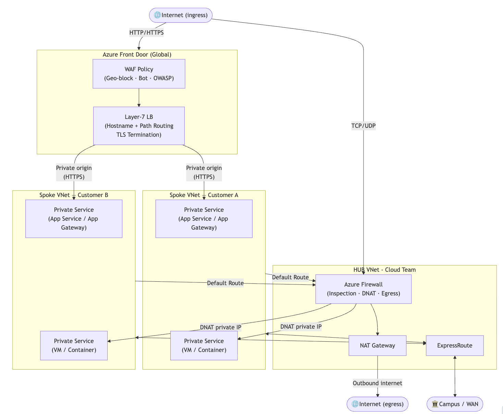
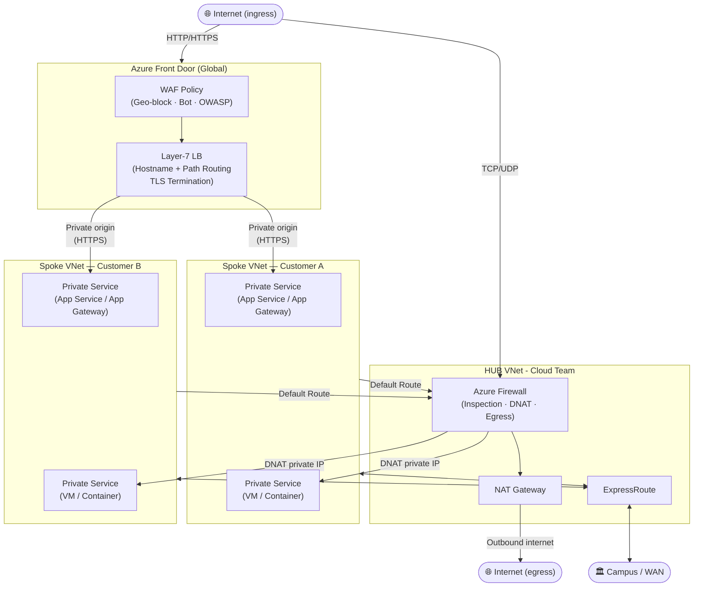

# Secure Azure Network Design

This section covers the networking services provided by TAMU in Microsoft Azure.

The Technology Services Cloud Services team provides all Azure customers with their own "spoke" Virtual Network (VNet) that is pre-configured and peered with a TAMU "hub" VNet to help you get started quickly with best practices and security controls as well as access to TAMU resources as needed. The shared hub VNet and its associated resources, like Azure Front Door and Azure Firewall, are shared across Azure customers at TAMU in a <em>hub-and-spoke</em> topography to significantly reduce individual cost and to centralize management of security compliant with [SC-7 Boundary Protection](https://docs.security.tamu.edu/docs/security-controls/SC/SC-7/).

> [!NOTE]
> You may be familiar with [our AWS network design](https://docs.cloud.tamu.edu/cloud/aws/networking.html), which shares the same goals, but each has an approach that is unique to its underlying cloud platform.

## Network Design

TAMU customer VNets are provisioned by TAMU Cloud Services with an address space allocated from a global pool assigned to your VNet for your use. Follow Azure best practices for dividing your address space into subnets and assigning resources to those subnets. Work with Cloud Services to ensure your requested VNet address space and proposed subnet design align with your solution's overall network design and best practices for security and performance. It is recommended to use one VNet per Azure Subscription per project per environment, but you can use as many subnets as you need within that VNet to segment your resources as needed.





> [!NOTE]
> **Key:**
> All _inbound_ internet traffic enters through Azure Front Door (HTTP/HTTPS) or Azure Firewall DNAT (TCP/UDP). All _outbound_ internet traffic exits through Azure Firewall and NAT Gateway. Customer spoke VNets have no direct internet path. WAN connectivity (campus networks, other clouds) is provided through the HUB via ExpressRoute or VPN Gateway.

External internet ingress is provided by a highly available Azure Front Door and/or Azure Firewall service that is managed by the Cloud Services team. These services provide security and access control for all resources in the VNet and integrate seamlessly with existing Azure security services, such as Network Security Groups (NSGs). Traffic is routed appropriately based on the type of traffic and the resources being accessed. For example, HTTP/HTTPS traffic is routed through Azure Front Door, while other TCP/UDP traffic is routed through Azure Firewall to the appropriate resources in the spoke VNets.

Pre-configuration, defaults, and Azure Policy help to ensure that your network resources comply with TAMU's security and management guidelines. If you need to claim an exception for your resources, please contact the Cloud Services team for assistance.

- **Public Subnets**: Directly public subnets are disallowed in this configuration. For resources that need to be accessible from the internet, private subnets are linked to Azure Front Door and Azure Firewall on the hub VNet. Additionally, you can add Azure Private Endpoints to secure inbound access to Azure PaaS services from private subnets.
- **Private Subnets**: The default state of subnets in this network design. These subnets are used for resources that are not directly accessible from the internet.
- **Dedicated Subnets**: Subnets should be, and in some cases must be, dedicated to a specific purpose or resource type, such as a subnet for virtual machines, a subnet for databases, etc. This helps to improve security and manageability of your resources. See [Deploying to a Private Subnet with GitHub Actions](./github_private.md) guide for an example.

See [Creating Subnets](./creating_subnets.md) for more information and guidance on how to create and configure subnets within your TAMU Cloud Services-provisioned VNet.

Finally, internet egress is routed from the customer spoke VNets through the same Azure Firewall and NAT Gateway services back to the requesting client.


## Private Connectivity to TAMU

TAMU has redundant ExpressRoute connections to Azure that provide a private, high-speed, low-latency connection to the Azure cloud. This connection is used to provide secure, private access between the TAMU campus network and Azure.

In general, it is recommended to use the internet to access resources in Azure. Use of this private connectivity is not recommended except when architecturally necessary. Instead, consider trying to decouple your resources depending on the campus networks and utilize alternatives that are already in the cloud, or extending that resource into the cloud. This will also help to reduce the risk of a single point of failure for your service.


## Exception Request

If you have a specific use case that requires a different network design, please contact the Cloud Services team to discuss your requirements. We will work with you to understand your needs while maintaining the security and integrity of the TAMU network.


## Reference

### Using VNet in Terraform

```hcl
# Get reference to existing vnet
data "azurerm_virtual_network" "spoke" {
  name                = "<vnet-name-not-resource-id>"
  resource_group_name = "<resource-group-name>"
}

# Reference the vnet in another resource
resource "azurerm_subnet" "workload" {
  name                 = "workload-subnet"
  resource_group_name  = data.azurerm_virtual_network.spoke.resource_group_name
  virtual_network_name = data.azurerm_virtual_network.spoke.name
  address_prefixes     = ["<cidr-block>"]
}
```

Note that it is not strictly necessary to reference the vnet in a data block like this, but it is a best practice to do so to ensure that you are using the correct vnet and to avoid hardcoding values that may change in the future. A tfplan will fail early if the vnet does not exist or if the name is incorrect, which can save time and prevent errors later.
