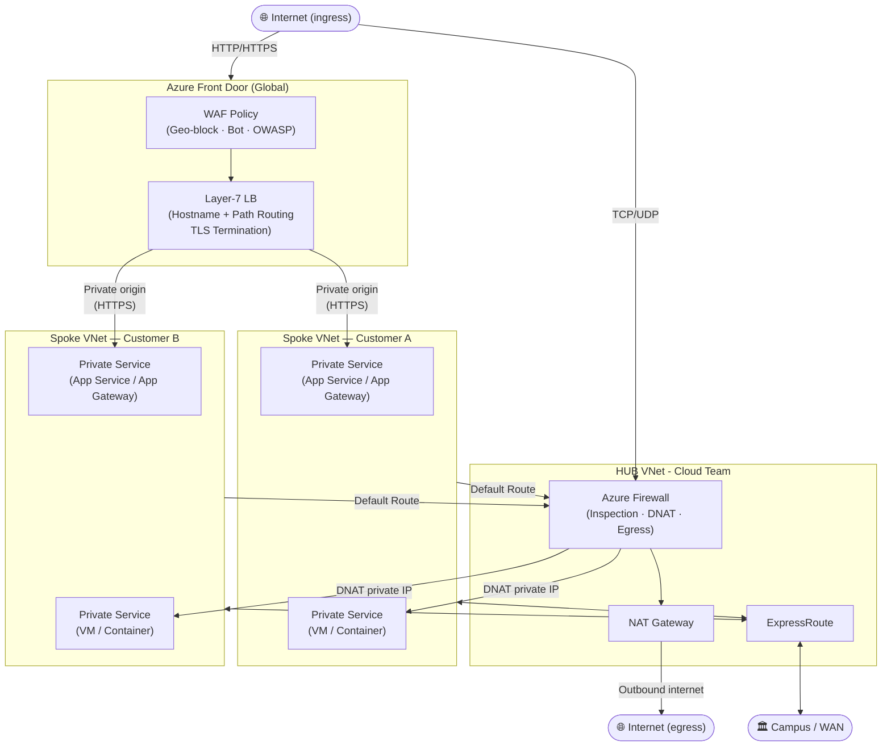

# Azure Network Design

Texas state law and Texas A&M University policies require that all TAMU networks be protected by a secure, managed boundary, and thus resources on those networks may not be directly accessible from the public internet. To meet these requirements, the TAMU-managed network in Azure is designed with a hub-and-spoke topology that centralizes traffic flow through shared Azure Front Door (AFD) with WAF rules and Azure Firewall (FW) for traffic analysis and logging.

## Design Overview

Cloud Services operates and manages the hub network, including the shared AFD and FW services, while customers are responsible for their own spoke networks and resources. The following diagram illustrates the overall network design and traffic flow for the TAMU-managed network in Azure.

> [!NOTE]
> **Key:**
> All _inbound_ internet traffic enters through Azure Front Door (HTTP/HTTPS) or Azure Firewall DNAT (TCP/UDP). All _outbound_ internet traffic exits through Azure Firewall and NAT Gateway. Customer spoke VNets have no direct internet path. WAN connectivity (campus networks, other clouds) is provided through the HUB via ExpressRoute or VPN Gateway.

## Implementation Details

- **Hub-and-Spoke Topology**: The network is designed with a hub-and-spoke topology, where the hub contains shared services (AFD, FW) and the spokes contain customer resources. This allows for centralized management of security and traffic flow while still providing flexibility for customers to manage their own resources in their spoke VNets.
- **Azure Front Door**: AFD is used for all HTTP/HTTPS traffic, providing global load balancing, SSL termination, and WAF capabilities. This allows for secure and performant access to web applications and services hosted in Azure. AFD is configured with WAF policies that include geo-blocking, bot protection, and OWASP rule sets to protect against common web vulnerabilities.
- **Azure Firewall**: FW is used for all other TCP/UDP traffic, providing stateful inspection, DNAT for inbound traffic, and egress control for outbound traffic. This allows for secure access to non-web workloads while still allowing for inspection and control of traffic. FW is also used to route traffic between the hub and spoke VNets, ensuring that all traffic is inspected and logged appropriately.
- **Private Connectivity**: The TAMU-managed network in Azure is connected to the campus network through ExpressRoute, providing a private, high-speed connection for secure access to resources in Azure. This allows for secure access to Azure resources without exposing them to the public internet, while still allowing for connectivity to on-premises resources and other cloud environments as needed.
- **Pre-configuration and Defaults**: The network is pre-configured with certain defaults and restrictions to ensure that resources are deployed in a secure and compliant manner. For example, public subnets are disallowed, and all subnets are private by default. Additionally, certain services, such as App Service, are configured to require Private Endpoints for connectivity to the VNet, ensuring that they are not exposed to the public internet.
- **Policy Enforcement**: Azure Policy is used to enforce compliance with the network design and security requirements. This includes policies that restrict the creation of public subnets, require the use of Private Endpoints for certain services, and ensure that all resources are deployed within the TAMU-managed network.

### Azure Front Door

Azure Front Door is a global, scalable entry point for web applications and services hosted in Azure. It provides features such as SSL termination, global load balancing, and Web Application Firewall (WAF) capabilities to protect against common web vulnerabilities. In the TAMU-managed network design, AFD is used as the primary entry point for all HTTP/HTTPS traffic, allowing for secure and performant access to web applications and services.

Cloud Services operates a shared instance of Azure Front Door that can be used by all customers in the TAMU-managed network. Customers can request to have their web applications or services added as origins to the shared AFD instance, and Cloud Services will configure the necessary routing and WAF policies to ensure secure access. Custom domains are supported and certificates will be managed by AFD and Cloud Services with automatic renewals.

Currently, this is a manual request and configuration process, but in the future we plan to automate this through self-service tools and integration with Azure services.

### Azure Firewall

Azure Firewall is a stateful firewall service that provides network and application-level protection for resources in Azure. It is used in the TAMU-managed network design to implement required rules to implement security controls, such as geoblocking and other targeted restrictions, and provide connectivity for non-web workloads that require public access.

The firewall is also used to route traffic between Azure virtual networks and campus networks.

Customers can request to have firewall rules added to the shared Azure Firewall instance to allow for secure access to their resources from the internet or other networks. Currently, this is a manual request and configuration process, but in the future we plan to automate this through self-service tools and integration with Azure services.

### ExpressRoute connectivity

The hub network uses ExpressRoute to provide a private, high-speed, low-latency connection between the campus network and Azure network. This allows for secure access to Azure resources without exposing them to the public internet, while still allowing for connectivity to on-premises resources and other cloud environments as needed.

In general, it is recommended to architect your service in a way that minimizes dependencies on services on other networks or locations. This will help reduce the total points of failure of your service and make it more resilient. If this cannot be avoided, consider extending the dependency into the cloud rather than relying on private connectivity back to the campus network, or syncing and caching the data from that service. If you do need to rely on private connectivity back to the campus network, ensure that you have implemented appropriate error handling and/or retry logic in your service to account for potential connectivity issues, and consider the impact of such issues on your overall service availability and performance.

## Provisioning and Configuration

Customer VNets ("spoke networks") are provisioned by Cloud Services with one or more IP address ranges (CIDR) allocated to it from a pool of address space. The default allocation will be 32 IP addresses (27 usable), but can be grown as needed.

Our default Azure region is `South Central US`, as it is closest to the TAMU campus and a majority of our user base and will have the lowest latency, and virtual networks will be provisioned in this region unless otherwise requested. Follow the guidance in [creating subnets](creating_subnets.md) for dividing your address space into subnets and connecting resources to those subnets. If you need to, work with Cloud Services to ensure your VNet address space and subnet design align with your solution's need and recommended best practices.

By default, no subnets will be created in spoke VNets since subnet design can vary greatly based on the types of resources being deployed. The customer is responsible for creating and configuring their own subnets within their VNet, but Cloud Services can provide guidance and best practices for doing so.

All subnets will be private with no direct access to or from the public internet. A user-defined route (UDR) will be created to route outbound internet traffic through the Azure Firewall and NAT Gateway services in the hub VNet and will need to be associated with each subnet. An Azure policy will be put in place to prevent the creation of public subnets, and to attach the default UDR to all subnets missing one.

## Public Resources

Resources that need to be accessible from the internet will be connected to private subnets and corresponding configurations applied to the hub services to allow for secure access. This includes Azure PaaS services that normally have a public endpoint, such as App Service, which will need to be connected to the VNet via Private Endpoints and have their public access disabled.

Azure Policies will be put in place to enforce the required configurations for public resources. See [Policies and Enforcement](./policies.md) for more information about the policies that will be applied to the TAMU-managed network in Azure.

## Spoke-to-Spoke Communication

The TAMU-managed Azure network has adopted a zero-trust model, and as such, by default, communication between spoke VNets is not allowed. If you have a use case that requires communication between spoke VNets, there are two options:

- You can request to have the necessary firewall rules added to the shared Azure Firewall instance to allow for secure communication between the spokes, or from all spokes to a specific spoke, if for instance you operate a shared service in your spoke. This is the recommended approach, as it allows for secure communication while still allowing for inspection and control of traffic through the firewall.
- If both spokes are managed by the same customer, or the other spoke is a trusted partner, you can peer the two spoke VNets together and create NSG rules to allow for communication between them. This bypasses the firewall and should only be done when appropriate.
