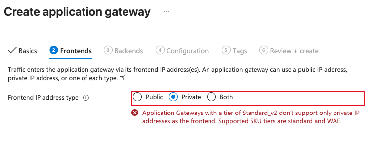

# Azure Application Gateways

> [!NOTE]
> In many cases, an existing Application Gateway (AGW) can be decommissioned to reduce cost and operational overhead if the centralized hub Azure Front Door (AFD) routing rules and Web Application Firewall (WAF) policies already meet the workload requirements.

> [!NOTE]
> Existing AGW with Public IP cannot be converted to private only. See below for [creating new and warning](#creating-new-agw-and-encountering-error-public-frontend-ip-configuration-is-not-allowed) that may be encountered as well as workaround.

- **Rule:** An Application Gateway (AGW) in a customer spoke VNet must be deployed privately and integrated with centralized hub ingress controls when internet access is required.
- **Action:** Deploy AGW into a dedicated private subnet, keep backend resources private, and work with Cloud Services to publish required ingress through hub services.

* AGW must not be configured with direct customer-managed public internet exposure outside of hub-centralized ingress controls.
* AGW requires a dedicated subnet and should not share that subnet with unrelated workloads.
* AGW subnet and backend subnets must have a User Defined Route (UDR) that sends outbound traffic to the hub-centralized firewall for inspection and logging.
* NSGs should follow least privilege and allow only required inbound traffic from approved sources (for example, campus network ranges, VPN, or explicitly approved private peer ranges).
* Administrative ports and management protocols must not be internet-exposed; use approved private access methods. See [Access Methods](../access_methods.md) for details.
* For internet-facing application traffic, work with Cloud Services to configure hub-managed ingress (typically AFD for HTTP/S and firewall DNAT for non-HTTP/S workloads).

Generally speaking, AGW behavior for backend pools, probes, listeners, and routing rules is configured as usual. The key TAMU-network differences are private placement, dedicated subnetting, and hub-managed internet ingress.

## Implementation Pattern

### Azure Front Door

If you intend to publish your application to the internet, the recommended approach is to do so through the hub-managed Azure Front Door (AFD). Using this method, a private endpoint for inbound access is created and managed by AFD, and do you do not have to create the private endpoint yourself.

However, when using AFD-managed private endpoints, only AFD can access your application, and all traffic must go through AFD. Internal/Private traffic from other resources or networks will require a private endpoint in your spoke VNet.

For more information, see [Access Methods](../access_methods.md).

### Private Endpoint for Internal/Private Access

Use this sequence for both new AGW deployments and updates to existing AGW workloads:

1. Confirm AGW is required (for example, advanced layer-7 routing/rewrites/TLS features not already met by centralized AFD + WAF).
2. Create or select a dedicated private subnet for AGW.
3. Confirm AGW and backend subnets have the default egress UDR associated to route outbound traffic through the hub firewall.
4. Deploy AGW in the dedicated subnet and configure listeners, probes, backend pools, and routing rules for required ports and paths.
5. Apply least-privilege NSG rules on AGW/backend subnets and validate private reachability first.

If internet ingress is required, submit a Cloud Services request for hub AFD, firewall, and/or DNS updates.

## Steps in Azure Portal

The steps below are generalized for new or existing AGW-backed services.

1. On Application Gateway: Frontends/Networking:
	 - Select your customer spoke VNet.
	 - Select or create a dedicated subnet for AGW.
	 - For Frontend IP Address Type, select Private (see [below](#creating-new-agw-and-encountering-error-public-frontend-ip-configuration-is-not-allowed)).
1. Configure backend pools, listeners, health probes, and routing rules as required by your application.
1. Open AGW/backend subnets > Route table and verify the hub firewall UDR is associated. See [Route Tables](../creating_subnets.md#route-tables) for details.
1. Review subnet NSGs and verify only required ports and approved source ranges are allowed.

## Example Terraform Snippets

### App Gateway (Private Frontend, Minimal)

```hcl
resource "azurerm_application_gateway" "workload" {
  ...

	sku {
		name     = "Standard_v2"
    ...
	}

	gateway_ip_configuration {
		name      = "agw-ipcfg"
		subnet_id = azurerm_subnet.agw.id
	}

	frontend_ip_configuration {
		name                          = "private-frontend"
		subnet_id                     = azurerm_subnet.agw.id
		private_ip_address_allocation = "Dynamic"
	}

	...
}
```

## Creating New AGW and Encountering Error "Public frontend IP configuration is not allowed"

**Existing AGW with Public IP cannot be converted to private only.** To remediate, a new AGW must be created with the correct private configuration, and then backend pools and routing rules can be switched over to the new AGW before decommissioning the old AGW.

However, in creating the new AGW, you may encounter the error <em>"Application Gateways with a tier of Standard_v2 don’t support only private IP addresses as the frontend. Supported SKU tiers are standard and WAF."</em> even if you have correctly configured the frontend as private:



This can occur if the AGW SKU/tier does not support private-only frontends or if there are lingering references to the old public frontend configuration: You can resolve this by enabling Preview Feature `EnableApplicationGatewayNetworkIsolation` in your subscription. See [Microsoft documentation](https://techcommunity.microsoft.com/blog/azureinfrastructureblog/%F0%9F%9A%80-general-availability-of-private-application-gateway-on-azure-application-gate/4508294#:~:text=Existing%20gateways%20cannot%20be%20retrofitted%E2%80%94network%20isolation%20must%20be%20enabled%20at%20creation%20time.) for details on the feature and how to enable it. After enabling the feature, you should be able to create the new AGW with a private-only frontend without encountering the error.

Attempting to create an AGW with both Private and Public may flag policies preventing public frontends in spoke VNets.
