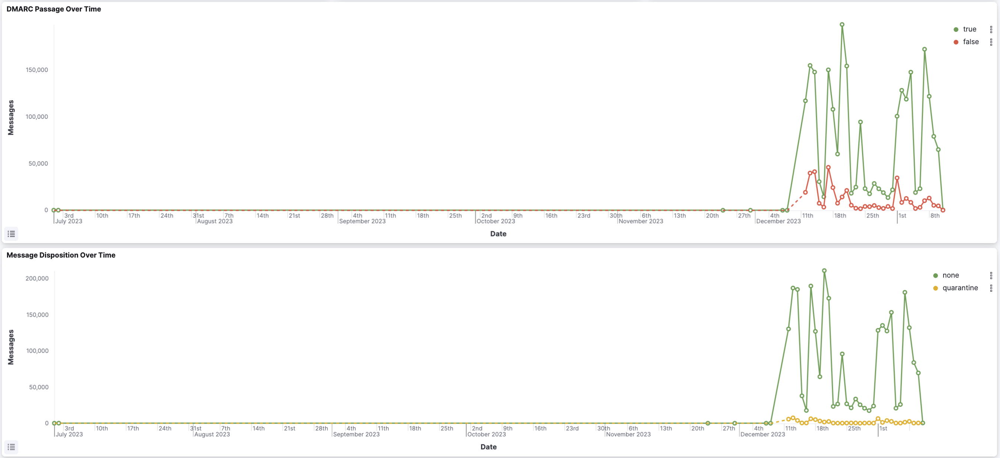
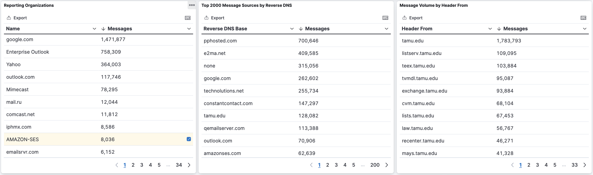
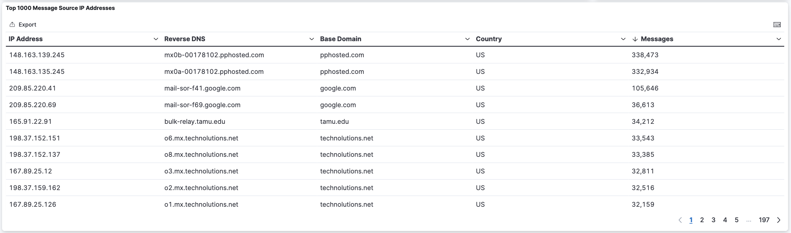
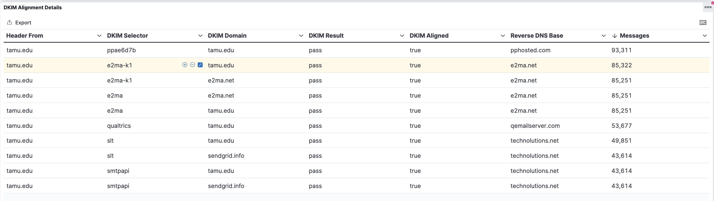

```admonish info
This site is a work in progress and will be updated regularly.  Please check back frequently for updates.
```

# DMARC Reporting Website

DMARC reports are sent by recipient mail services such as Gmail, Yahoo, Outlook and others. The information in the reports helps you understand which messages sent on behalf of your domain are passing SPF, DKIM, and DMARC.

The DMARC Reporting website uses Kibana dashboards for aggregated DMARC report data.  This data can be used by technology professionals and email administrators to determine:

- What servers or third-party senders are sending mail for your domain
- What percent of messages from your domain pass DMARC
- Which servers or services are sending messages that fail DMARC
- What DMARC actions the receiving server takes on unauthenticated messages from your domain: none, quarantine, or reject.

```admonish info
The service only keeps data reported within the last 30 days. To see deliverability information beyond 30 days, other tools are available.
```

## Dashboards

After navigating to this site and selecting the DMARC Summary dashboard, you will see the following:

- **From Domain panel** - a dropdown with a list of from domains that can be used to filter the data
- **Total Message Count** - the number of messages reported on for the domain in the last 30 days


- **SPF Alignment** - pie chart that displays the percentage messages that pass or fail SPF
- **DKIM Alignment** - pie chart that displays the percentage messages that pass or fail DKIM
- **DMARC Passage** - pie chart that displays the percentage messages that pass or fail DMARC


- **DMARC Passage Over Time** - chart of how many messages passed DMARC over time
- **Message Disposition over Time** -  chart of the number of messages that had a specific DMARC policy applied; if the status is 'none', that means that the policy was not applied and that the email reached the recipient's inbox, whereas 'quarantine' and 'reject' mean the policy was applied and that the message was either quarantined or rejected



- **Reporting Organizations** - a table with a list of organizations that are sending DMARC reports for the specified domain
- **Top 2000 Message Sources by Reverse DNS** - a table with a list of sending servers grouped by the base domain in their reverse DNS
- **Message Volume by Header From** - a table with a list of email from domains, sorted by message volume



- **Map of Message Source Countries** - a map of the world outlining how many messages were received from each country
- **Message Source Countries** - a table with the number of messages received from each country on the map


- **Top 1000 Message Source IP Addresses** - a table with a breakdown of the top 1000 message source IPs



- **Overview** - a table that provides an overall look at the DMARC Report data, including if SPF and/or DKIM passed and if SPF or DKIM passed DMARC authentication


- **Published Policies (as reported)** - a table that provides information about which published DMARC Policy was applied
- **SPF Alignment Details** - a table with information on SPF, its passage and alignment (did DMARC pass using SPF)


- **DKIM Alignment Details** - a table with information on DKIM, its passage and alignment (did DMARC pass using DKIM)



```admonish warning
The dashboards do not provide information on the status of specific email messages. Instead, it was designed to provide insight into who is sending mail on behalf of your domain.
```

## Using the Site

### Login

1) Navigate to the DMARC Reporting Site (coming soon, reach out to [cloudsecurity@tamu.edu](mailto:cloudsecurity@tamu.edu) for early access)
2) Login by selecting 'Login with Azure AD'
3) From the List of Dashboards -> select 'DMARC Summary'


### Filter for specific domain(s)

Filtering for specific domain(s) will help you determine who is sending on behalf of a given `tamu.edu` subdomain.  To filter for specific domain(s), use the 'From Domain' dropdown to search for and select subdomain(s).  The dashboards will update based upon the selected 'From Domain(s)'.

### Filter for failed DMARC results

The main purpose of the DMARC Reporting dashboard is to determine who is sending no your behalf and is failing DMARC compliance.  To filter by failed DMARC results, navigate to the 'DMARC Passage' pie chart, select the three dots next to 'false' and select 'filter for'.

### Filter for a specific Organization

Filtering which organizations have sent on your behalf can help narrow down services and configuration issues.  To apply this filter, navigate to the 'Reporting Organizations' panel, hover of the name of the organization you want to filter and select the '+' button.

### Additional Information

You can filter on different values by hovering your mouse over a data table value and using the magnifying glass icons.  Some additional filters that could be helpful are:

| Dashboard Panel | Field(s) to Filter |
| -------- | ------- |
| Top 1000 Message Source by IP Address | IP address |
| Overview | Disposition |
| SPF Alignment | Envelope From, SPF Result, SPF Alignment |
| DKIM Alignment | DKIM Selector, DKIM Domain, DKIM Result, DKIM Alignment |

In addition, the data can be filtered further to view specific time periods.  To clear a filtered field, scroll to the top and click the 'x' next to the filter you wish to remove.  The selected domain(s) can be cleared by hovering over the 'From Domain' dropdown and clicking the eraser icon.
