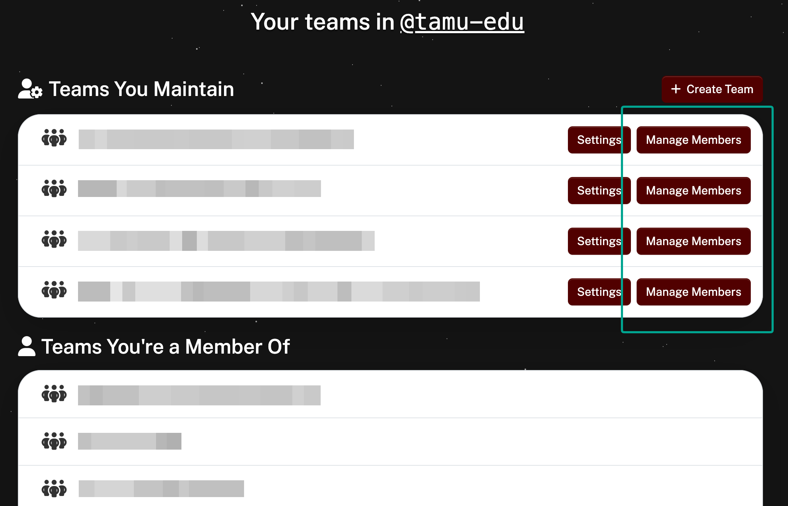
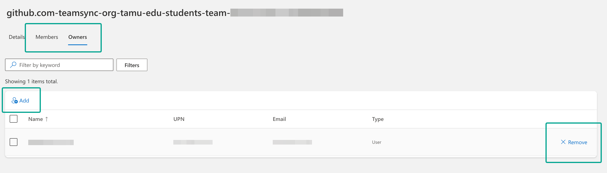

# GitHub Teams

Teams are the building blocks for managing members in a GitHub organization. They reflect an organization's structure with cascading access permissions and mentions.

To learn more about teams, please see [About teams](https://docs.github.com/en/organizations/organizing-members-into-teams/about-teams).

Manage your Texas A&M University GitHub Teams with the [Texas A&M University GitHub portal](https://github.cloud.tamu.edu) ([https://github.cloud.tamu.edu](https://github.cloud.tamu.edu)).

## Team Membership

GitHub Teams are created and synchronized from the Texas A&M University directory. Create a team every time a unique set of people need to collaborate on a project or repository.

Teams can be created using the `Create a Team` link for an organization in the [Texas A&M University GitHub portal](https://github.cloud.tamu.edu). A NetID login is required to create a team, and an API endpoint will be available in the future for automated and programmatic team creation.

Create Team Buttons Screenshot

<em>External collaborators (non-Texas A&M University members with no NetId) cannot be added to teams. External collaborators can only be added individually, directly to repositories.</em>

**The team creator is the first and only owner and member until additional members are added.**

## Managing Team Members

Team members are synchronized from groups in the Texas A&M University directory using Microsoft Entra ID (formerly Azure Active Directory (Azure AD)). Team owners can add, remove, and manage members and other owners from the Texas A&M University GitHub portal under `My Teams > <Team> > Manage Members`:

Manage Members Buttons Screenshot

Clicking `Manage Members` will open an Entra ID screen for managing group members corresponding to the synchronized team. Here you can add or remove members and owners. Be sure you are on the correct tab for `Members` or `Owners`:

Manage Team Members Screenshot

<em>External collaborators (non-Texas A&M University members with no NetId) cannot be added to teams. External collaborators can only be added individually, directly to repositories.</em>

Users added won't be synchronized to their respective GitHub teams unless they are direct members of the organization. Instruct and encourage them to join the organization on the [Texas A&M University GitHub portal](https://github.cloud.tamu.edu). After joining the organization, their team member status will automatically synchronize within one hour.

## Repository Collaborators, Roles, and Group-Based Access Control

Teams can be assigned to repositories to grant access to all team members at once. This simplifies permission management for groups like project teams or departments. Repository admins can assign roles such as `Read`, `Triage`, `Write`, `Maintain`, or `Admin` to an entire team, ensuring consistent and single point access control for individuals across repositories. This is done through the repository settings under `Settings > Manage Access`.

Since only a repository `Admin` can assign teams or individuals to a repository, it is advisable to have multiple `Admin` users per repository. Implement group-based access control by creating a team with `Admin` privileges for repository administration and assigning multiple trusted users to that team to ensure continuity and proper management of repository access.

<em>External collaborators (non-Texas A&M University members with no NetId) cannot be added to teams. External collaborators can only be added individually, directly to repositories.</em>

## Course- and Enrollment-based teams

We are actively exploring options to create automatically-updating teams based on course and section enrollment and hope to release this as a feature soon. In the meantime, please add students directly to a repository without using a team until we can provide the enrollment-team feature and ensure full FERPA compliance.