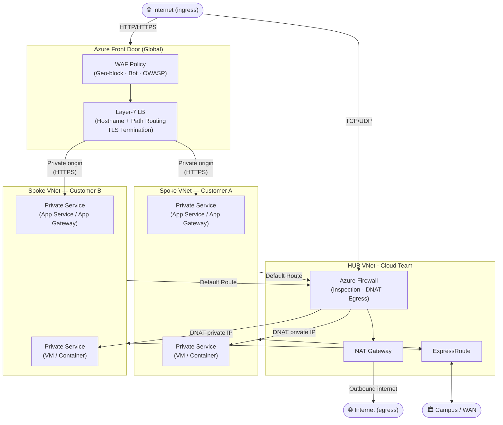

> [!NOTE]
> This site is a work in progress and will be updated regularly.  Please check back frequently for updates.

# The following is a test of the mermaid plugin for mdbook

# ^^ That should look like the network diagram we have in the forthcoming PRs.

This website is a resource for Texas A&M University faculty, and staff to learn about the various infrastructure and platform services available at Texas A&M University. This includes information about cloud services, platform services, and security policies and best practices.

It is maintained by a distributed team of engineers in Technology Services who contribute information relevant to their area of expertise.

## Contributing

If you are a member of the Texas A&M University community and would like to contribute to this website, please get involved over on [GitHub](https://github.com/tamu-edu/it-cloud-docs).

