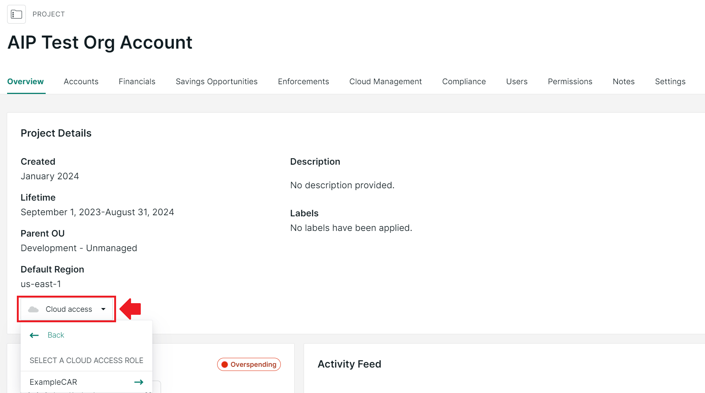
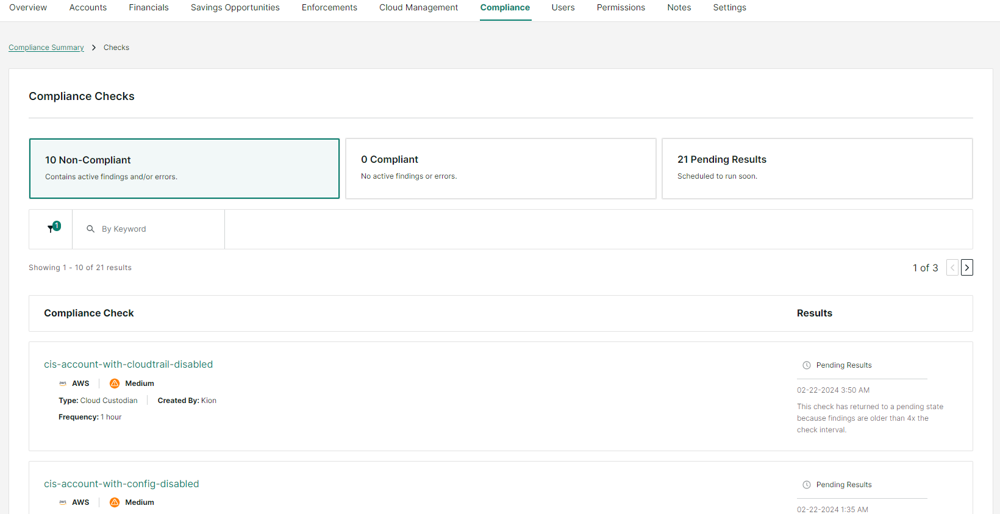

# Getting Started With Kion

## Key Features 

- Access your cloud accounts via the Overview tab: 

Kion Overview

- Track budgets, monthly spending, and get estimated spend (based on current usage) for all accounts associated with a project in the Financials tab. 

Kion Financials

- In the Compliance tab, Track compliance posture against several industry standards, including CIS 1.2.0 for AWS and 1.3.0 for Azure, and against Texas A&M University's Security Controls catalog for the varying degrees of data classification. 

Kion Compliance

Compliance Findings

Finding Details

- Grant access to your projects or individual accounts after the user receiving access to the accounts has already logged into Kion. 

Project Access

- Identify savings opportunities by identifying over-provisioned resources that can be reduced in size and cost in the Savings Opportunities Tab. 

> [!NOTE]
> screenshot pending, as the example project does not have any current savings opportunities.

## Advanced Features 

- In the Enforcements tab, configure actions you can set to trigger on an project when a spending limit is surpassed. See Kion's documentation on Project Financial Enforcements for more information.

Budget Enforcements

Enforcement Example

- In the Cloud Management tab, you can create customized permissions for users or service accounts and apply new compliance standards. See Kion's documentation on Cloud Access Roles and Cloud Rules for more information. 

Cloud Access

> [!NOTE]
> for more information on Cloud Access Roles and Cloud Rules, please refer to [User Group Management](./user_group_management.md)
